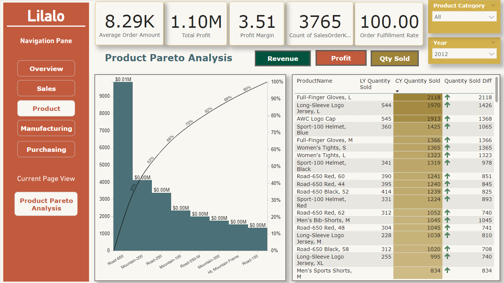
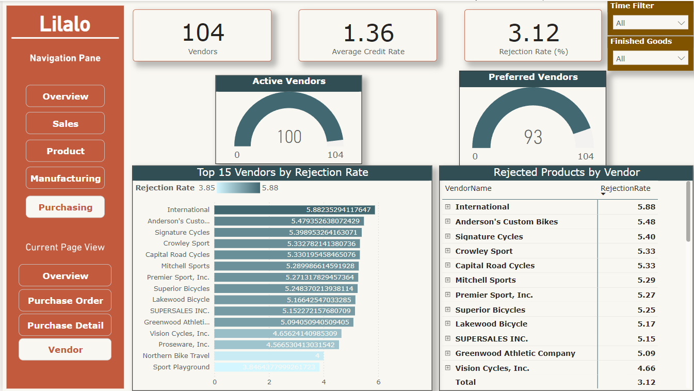
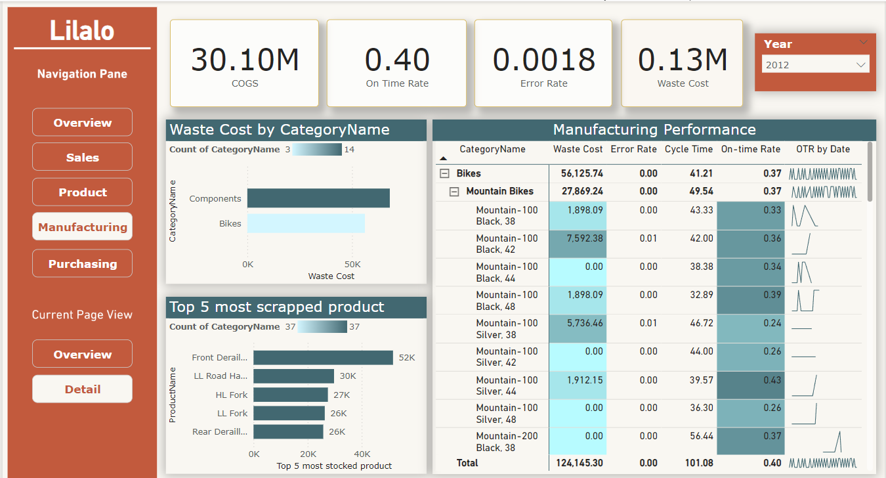

# Cloud-Based Business Intelligence Solution for Supply Chain Management

## Introduction

This project, undertaken by Group Live Laugh Love from the University of Economics and Law, focuses on developing a cloud-based Business Intelligence (BI) solution to enhance the supply chain management of Adventure Works Cycles (AWC). Our aim is to integrate data from various departments to provide actionable insights and support informed decision-making.

## Team Members
- Trần Hoàng Anh (K214162143)
- Lê Quốc Dân An (K214162140)
- Cao Nguyễn Hải Như (K214162148)
- Trần Thị Minh Hiền (K214160989)

## Data Engineering

Our data engineering efforts encompassed the following:

1. **Data Source Layer:** 
   - We utilized the AdventureWorks 2019 database as our primary data source, hosted on Azure SQL Server.

2. **Data Ingestion Layer:** 
   - We employed Azure Data Factory to extract data from the AdventureWorks2019 database. This data was then ingested into Azure Data Lake Storage Gen2, stored as parquet files.

3. **Data Storage Layer:** 
   - The data was organized into three tiers within Azure Data Lake Storage Gen2:
     - **Bronze:** Raw data
     - **Silver:** Pre-processed data
     - **Gold:** Enriched and refined data ready for analytics

4. **Data Process Layer:** 
   - The processed data in the Gold layer was loaded into Azure Synapse Serverless SQL Pool 

5. **Consumption Layer:** 
   - Data from  Azure Synapse Serverless SQL Pool is integrated into Power BI for detailed analysis and visualization.
   - We built a data model consisting of Fact, Dimension, and Bridge tables to facilitate efficient data analysis.

## Dashboards Built

We developed several interactive dashboards in Power BI to provide insights into different aspects of AWC’s operations:

### Overview Dashboard
The Overview Dashboard provides a high-level summary of the company’s overall performance, focusing on key metrics related to product inventory management, sales, purchasing, manufacturing, and product lifecycle.

- **Overview Page:** Summarizes critical KPIs and serves as a navigation hub for detailed analysis.

### Sales Dashboard
The Sales Dashboard offers detailed insights into sales performance, highlighting revenue generation, profitability, and sales trends over time.

- **Sales Overview:** Displays overall sales performance and trends.

- **KPI Scoreboards:** Showcases key performance indicators for quick assessment.

### Product Dashboard
The Product Dashboard provides an in-depth analysis of the company’s product portfolio, tracking financial and operational performance throughout the product lifecycle.

- **Product Analysis:** Focuses on profitability, product performance, and lifecycle metrics.

### Purchasing Dashboard
The Purchasing Dashboard analyzes purchasing operations, tracking key metrics such as quantity ordered, preferred vendors, and rejection rates.

- **Purchasing Overview:** Summarizes purchasing activities and key metrics.

- **Purchase Detail:** Provides detailed analysis of purchase transactions.

- **Purchase Order Analysis:** Tracks purchase orders and their efficiency.

- **Vendor Analysis:** Evaluates vendor performance and reliability.

### Manufacturing Dashboard
The Manufacturing Dashboard delivers comprehensive insights into manufacturing processes, focusing on metrics such as average manufacturing time, error rate, and manufacturing efficiency.

- **Manufacturing Overview:** Provides a high-level view of manufacturing efficiency and performance.

- **Manufacturing Detail:** Offers detailed metrics on manufacturing processes, including error rates and production times.

## Acknowledgements

We express our sincere appreciation to MSc. Le Ba Thien for his invaluable feedback and support throughout this project.
